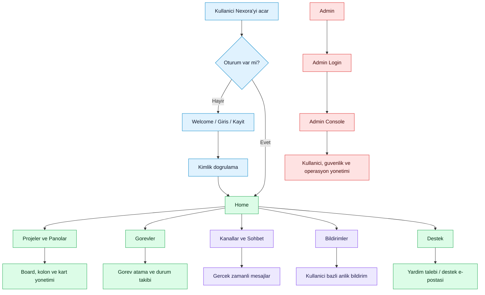
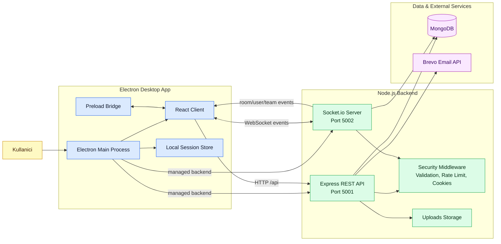

# Nexora

Nexora, ekiplerin proje, pano, gorev, kanal mesajlasmasi ve bildirim sureclerini tek masaustu uygulamasinda yonetmesi icin gelistirilmis bir is takip platformudur. Urun; React tabanli kullanici arayuzu, Node.js/Express API, Socket.io gercek zamanli servisleri ve Electron masaustu kabugu ile calisir.

## Urun Ozeti

Nexora'nin ana amaci, ekip calismasini daginik araclar yerine tek bir operasyon ekraninda toplamaktir.

- Proje ve pano yonetimi: Ekipler projeleri, panolari, kolonlari ve kartlari olusturup takip eder.
- Gorev atama: Kartlar kullanicilara atanir, durum degisiklikleri gercek zamanli izlenir.
- Kanal mesajlasmasi: Takim veya proje odakli kanallar uzerinden iletisim kurulur.
- Bildirimler: Gorev atamalari ve onemli olaylar kullaniciya anlik olarak iletilir.
- Admin konsolu: Kullanici, guvenlik, destek ve yonetim islemleri ayrilmis admin ekranindan yapilir.
- Masaustu deneyimi: Electron ile paketlenebilir, deep link ve yerel oturum yonetimi desteklenir.

## Urun Akisi



## Sistem Topolojisi



## Modul Haritasi

| Katman | Klasor | Sorumluluk |
| --- | --- | --- |
| Masaustu kabugu | `electron/` | Pencere yonetimi, deep link, IPC, backend servislerini baslatma, yerel oturum ve Socket baglantisi |
| Web istemci | `client/src/` | React sayfalari, formlar, panolar, gorevler, kanallar, bildirimler ve desktop bridge entegrasyonu |
| API sunucusu | `server/app.js`, `server/routes/`, `server/controllers/` | REST endpointleri, request dogrulama, CORS, upload servisleri ve hata yonetimi |
| Gercek zamanli servis | `server/realtime/` | Socket.io kimlik dogrulama, oda yetkilendirme, mesaj, kanal ve gorev olaylari |
| Is kurallari | `server/services/` | Proje, kanal, bildirim, audit log ve guvenlik servisleri |
| Veri modeli | `server/models/` | MongoDB/Mongoose modelleri |
| Guvenlik | `server/security/`, `server/middleware/` | Cookie ayarlari, payload validasyonu, rate limit, admin/user auth middleware |

## Temel Ozellikler

### Kullanici deneyimi

- Welcome, giris, kayit ve sifre sifirlama akislari
- Home altinda dashboard, proje, pano, gorev ve ekran sayfalari
- Son ziyaret edilen alanlar ve desktop route handler destegi
- Profil, kullanici bilgisi, filtre, kart detay ve onay modallari

### Ekip ve is yonetimi

- Proje, takim ve pano olusturma
- Kolon ve kart bazli is takibi
- Kart detaylari, kart tasima, kart/gorev duzenleme
- Kullaniciya gorev atama ve gorev durumunu guncelleme

### Gercek zamanli iletisim

- Socket.io ile oda bazli mesajlasma
- Kanal olusturma, davet, katilma ve kanal mesajlari
- Kullanici ve takim bazli anlik gorev olaylari
- Bildirim kaydi ve kullaniciya anlik iletim

### Admin ve guvenlik

- Ayrilmis admin girisi ve admin konsolu
- Login, refresh ve destek endpointleri icin rate limit
- Socket event rate limit ve payload sema dogrulamasi
- Security audit log ve admin action audit altyapisi
- JWT, refresh token ve cookie tabanli oturum destegi

## Teknoloji Stack'i

- React 18 ve React Router
- Electron 29
- Node.js, Express 5
- Socket.io 4
- MongoDB ve Mongoose
- React Hook Form ve Yup
- Electron Builder
- Brevo e-posta entegrasyonu

## Kurulum

Kok dizinde bagimliliklari yukleyin:

```bash
npm install
npm --prefix client install
npm --prefix server install
```

`server/.env` dosyasinda en az su degerler tanimli olmalidir:

```bash
MONGODB_URI=mongodb://127.0.0.1:27017/nexora
JWT_SECRET=change-me
JWT_REFRESH_SECRET=change-me-refresh
CLIENT_URL=http://localhost:3000,http://127.0.0.1:3000
PORT=5001
SOCKET_PORT=5002
```

E-posta, admin ve paketli masaustu davranislari icin kullanilabilecek ek degiskenler:

```bash
ADMIN_USERNAME=admin
ADMIN_PASSWORD=change-me
ADMIN_EMAIL=admin@example.com
BREVO_API_KEY=
BREVO_SENDER_EMAIL=
BREVO_SENDER_NAME=Nexora
DATA_ENCRYPTION_KEY=
DESKTOP_PROTOCOL_URL=nexora://
```

## Gelistirme

React istemci ve Electron uygulamasini birlikte baslatmak:

```bash
npm run dev
```

Sadece API sunucusunu calistirmak:

```bash
npm run start:server
```

Sadece Socket.io sunucusunu calistirmak:

```bash
npm --prefix server run dev:socket
```

Sadece React istemciyi calistirmak:

```bash
npm run start:client
```

Varsayilan yerel adresler:

| Servis | Adres |
| --- | --- |
| React client | `http://localhost:3000` |
| REST API | `http://127.0.0.1:5001/api` |
| Socket.io | `http://127.0.0.1:5002` |

## Paketleme

Client build ve server kaynaklarini hazirlayarak Electron paketi almak:

```bash
npm run pack
```

Platform bazli dagitim:

```bash
npm run dist:mac
npm run dist:win
npm run dist:all
```

Paketli uygulamada Electron, `server/server.js` ve `server/realtime/socketServer.js` servislerini managed backend olarak baslatir. Upload dosyalari paketli ortamda kullanici veri dizinine yonlendirilir.

## API Yuzeyi

| Endpoint grubu | Amac |
| --- | --- |
| `/api/auth` | Kullanici girisi, kayit, refresh token, sifre sifirlama ve dogrulama |
| `/api/admin` | Admin girisi, admin profili ve yonetim islemleri |
| `/api/users` | Kullanici bilgileri ve profil islemleri |
| `/api/projects` | Proje yonetimi |
| `/api/teams` | Takim yonetimi |
| `/api/boards` | Pano, kolon ve kart operasyonlari |
| `/api/tasks` | Gorev atama ve durum takibi |
| `/api/channels` | Kanal, davet ve kanal uyeligi islemleri |
| `/api/notifications` | Bildirim listesi ve durumlari |
| `/api/support` | Yardim ve destek talepleri |

## Socket Olaylari

| Olay | Amac |
| --- | --- |
| `joinRoom`, `leaveRoom` | Yetkili oda katilimi ve odadan ayrilma |
| `sendMessage`, `receiveMessage` | Oda bazli mesajlasma |
| `assignTask`, `taskAssigned` | Gorev atama ve anlik gorev bildirimi |
| `updateTaskStatus`, `taskStatusUpdated` | Gorev durumunu guncelleme |
| `listChannels`, `createChannel` | Kanal listeleme ve kanal olusturma |
| `inviteToChannel`, `acceptChannelInvite` | Kanal davet akisi |
| `joinChannel`, `leaveChannel` | Kanal odasi uyeligi |
| `sendChannelMessage`, `updateChannelMessage`, `deleteChannelMessage` | Kanal mesaj yasam dongusu |

## Proje Yapisi

```text
.
|-- client/              React istemci uygulamasi
|-- electron/            Electron main, preload ve desktop servisleri
|-- server/              Express API, Socket.io, modeller ve servisler
|-- installer/           Mac/Windows kurulum metinleri
|-- scripts/             Dagitim yardimci scriptleri
|-- package.json         Kok Electron ve dagitim komutlari
```

## Notlar

- README icindeki diyagramlar Mermaid destekleyen GitHub, GitLab ve modern Markdown araclarinda renkli gorunur.
- `server/.env` dosyasi hem REST API hem de Socket.io sunucusu tarafindan yuklenir.
- Masaustu uygulamada deep link semasi `nexora://` olarak tanimlidir.
- Socket servisleri kimlik dogrulamasi, oda yetkilendirmesi ve event bazli rate limit uygular.
